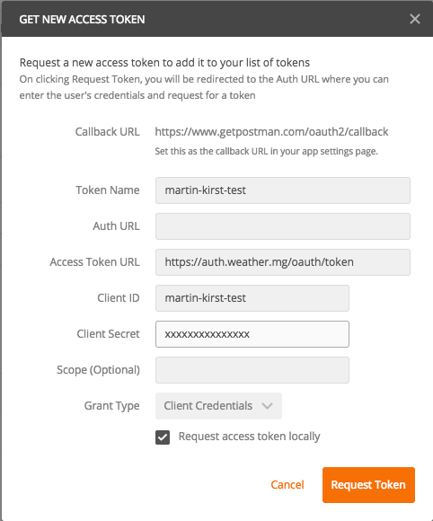

# Authentication

<!-- TOC -->
- [Authentication](#authentication)
    - [Overview](#overview)
    - [Authorization Flow](#authorization-flow)
           - [The following grapic visualises the basic flow.](#the-following-grapic-visualises-the-basic-flow)
           - [Sample HTTP Request sequence](#sample-http-request-sequence)
           - [Java Code Sample](#java-code-sample)
           - [Postman Sample](#postman-sample)
<!-- /TOC -->


## Overview
Every resource of the Weather API is secured via OAuth 2.0. Each request requires a valid token from our central authorisation server. These tokens have a validity period of one hour.

The Required client credentials for this authentication can be requested via this [form](https://meteogroup.zendesk.com/hc/en-gb/requests/new?ticket_form_id=64951).

## Authorization Flow

Authorisation is obtained using OAuth 2.0 client_credentials grant type (see also [RFC6749: "The OAuth 2.0 Authorization Framework" section 4.4](https://tools.ietf.org/html/rfc6749#section-4.4)).

####The following grapic visualises the basic flow.


1) In order to authenticate for the authorization request, the client has to provide client credentials (i.e. ```client_id``` and ```client_secret```) as ```userid``` and ```password``` via HTTP Basic Authentication.

2) After successful authentication the client retrieves an authentication token as response. This access token comes in the form of a [JSON Web Token (JWT)](https://jwt.io/introduction/). 

3) The access token can now be used to access Weather API Resources. The access token therefore is submitted as HTTP ```Authorization``` header of type ```Bearer```, when requesting against any resource.

The access token can be reused for multiple requests until it expires (which will happen one hour after it was issued).


#### Sample HTTP Request sequence
__Authorization Request:__

```
POST /oauth/token HTTP/1.1
Authorization: ***** HTTP basic authentication with client_id and client_secret *****
Content-Type: application/x-www-form-urlencoded; charset=utf-8
Host: auth.weather.mg
Connection: close

grant_type=client_credentials
```

__Authorization Response:__ 

```
HTTP/1.1 200 
Cache-Control: no-store
Pragma: no-cache
Content-Type: application/json;charset=UTF-8
Connection: close
{
    "access_token": "JWT_ACCESS_TOKEN",
    "token_type": "bearer",
    "expires_in": 3600,
    "scope": "space separated list of allowed scopes",
    "domain": "meteogroup",
    "jti": "id of JWT_ACCESS_TOKEN"
}
```
__Resource Request:__

```
GET /observation?location=53,13 HTTP/1.1
Authorization: Bearer JWT_ACCESS_TOKEN
Host: api.weather.mg
Connection: close
```
__Resource Response omitted__

```...```

## Java Code Sample

For an implementation in Java we recommend the usage of Zalandos open source ```tokens``` library (see [https://github.com/zalando/tokens](https://github.com/zalando/tokens) for details).

``` 
AccessTokens accessTokens = Tokens.createAccessTokensWithUri(new URI("https://auth.weather.mg/oauth/token"))
        .usingClientCredentialsProvider(() -> new SimpleClientCredentials("your_client_id", "your_client_secret"))
        .usingUserCredentialsProvider(() -> null)
        .manageToken("token_name")
        .withGrantType("client_credentials")
        .done()
        .start();
        
```

The created ```accessTokens``` instance now handles the management for the tokens transparently. 

By calling ```accessTokens.get("token_name")``` a valid token is provided. Per default that token has at least 40% of lifetime remaining (which in this case would mean 24 minutes). Whenever the lifetime falls below that (configurable) value a new token is requested in the background.

To use the token in a request, set the token as ```Bearer``` in the ```Authorization``` header.


```
/**
*  example with Apache HTTP Client
*/
final String accessToken = accessTokens.get("token_name")

CloseableHttpClient httpClient = HttpClients.createDefault();

HttpGet get = new HttpGet("https://api.weather.mg/observation?location=53,13");
get.setHeader("Authorization", "Bearer " + accessToken);

CloseableHttpResponse httpResponse = httpClient.execute(get);
// process response...
```

```
/**
* example with Spring Resttemplate
*/
final String accessToken = accessTokens.get("token_name")

HttpHeaders headers = new HttpHeaders();
headers.set(HttpHeaders.AUTHORIZATION, "Bearer " + accessToken);
HttpEntity entity = new HttpEntity<>(headers);

ResponseEntity<ResponseType> response = restTemplate.exchange(entity, ResponseType.class);
// process response...
```

## Postman Sample

Access token configuration in [Postman](https://www.getpostman.com):

